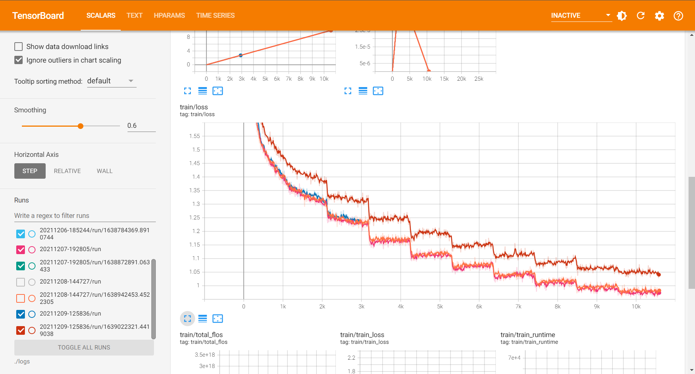

# KoBART Summarization for DACON Competition

본 저장소는 한국가스공사에서 주최 및 주관하고, 데이콘에서 운영하는 [가스・에너지분야 문서요약 모델개발](https://dacon.io/competitions/official/235829/overview/description) 경진대회에 참여한 `이야기연구소 주식회사`팀의 결과 발표 자료입니다. SKT-AI에서 배포한 [KoBART](https://github.com/SKT-AI/KoBART) PLM에 대해, AI Hub에서 제공하는 [문서요약 텍스트](https://aihub.or.kr/aidata/8054)의 신문기사 약 30만건으로 Fine Tuning을 진행하였습니다.

경진대회간 수행 내용을 본 저장소를 통해 공유하는 주요 목적은 다음과 같습니다.

* 경진대회 1차평가 제출
* 대회에서 수행한 실험 과정 및 결과의 신뢰성 함양
* 자료 및 코드의 투명한 공유를 통해 관련 분야에 대한 신진 연구자들의 접근 장벽 완화


## Preliminary

Github 저장소를 내려받아 관련된 코드를 준비합니다.

```bash
$ git clone https://github.com/cawandmilk/gas.git
$ cd gas
```

이후, 파이썬 가상 환경을 만들고, 필요한 라이브러리를 설치합니다.

기본적으로, 사용자는 `Python 3.8` 이상의 버전이 필요합니다.

```bash
$ python -m venv venv
$ source ./venv/bin/activate
$ pip install -r rquirements.txt
```


## Prepare Dataset

본 저장소에서 훈련 및 검증용으로 사용한 데이터세트는 과학기술정보통신부가 주관하고 한국지능정보사회진흥원이 지원하는 `인공지능 학습용 데이터 구축사업`으로 구축된 데이터로, 저작권 및 관련 이용정책에 따라 개인이 임의로 배포할 수 없습니다. 따라서 사용자가 직접 [공식 홈페이지](https://aihub.or.kr/aidata/8054)에서 승인을 받아 파일을 내려받고, 압축을 해제하는 과정이 필요합니다.

평가용 데이터는 [데이콘 경진대회 홈페이지](https://dacon.io/competitions/official/235829/overview/description)에서 받았지만, 대회 규칙상 공식적인 참여자가 아닌 경우 다운로드가 제한될 가능성이 있습니다.

초기 데이터는 아래와 같이 압축 해제되어 있다고 가정합니다.

```bash
$ tree ./data
./data
└── [  52]  raw
    ├── [  94]  Test
    │   ├── [129K]  new_sample_submission.csv
    │   ├── [ 21M]  new_test_.json
    │   ├── [ 34M]  new_test.jsonl
    │   └── [  53]  old
    │       ├── [ 81K]  sample_submission.csv
    │       └── [ 19M]  test.jsonl
    ├── [ 231]  Training
    │   ├── [ 90M]  법률_train_original.json
    │   ├── [346M]  사설잡지_train_original.json
    │   ├── [1.2G]  신문기사_train_original.json
    │   ├── [ 18M]  법률_train_original.zip
    │   ├── [ 83M]  사설잡지_train_original.zip
    │   └── [296M]  신문기사_train_original.zip
    └── [ 231]  Validation
        ├── [8.5M]  법률_valid_original.json
        ├── [ 35M]  사설잡지_valid_original.json
        ├── [140M]  신문기사_valid_original.json
        ├── [1.6M]  법률_valid_original.zip
        ├── [7.9M]  사설잡지_valid_original.zip
        └── [ 34M]  신문기사_valid_original.zip

5 directories, 17 files
```


## Preprocess

모델에 부정적인 영향을 미칠 것으로 예상되는 일부 텍스트에 대한 정제작업을 수행합니다. 이때 `모델에 부정적인 영향을 미칠 것으로 예상`되는 대부분의 데이터들은 어디까지나 개발자의 주관에 의존하므로, 그 범위를 적절히 조정해가며 여러 번 훈련을 진행해야 할 필요성이 있습니다. 가령, 아래와 같은 내용이 있을 수 있습니다.

* 일부 기사에서는, 다음과 같은 광고 문구들이 기사 마지막에 추가되어 있는 경우가 존재합니다. 
  * <"id": "350912775", "media_name": "부산일보">
    * ▶ 네이버에서 부산일보 구독하기 클릭!
    * ▶ 부산일보 구독하고 스타벅스 Get 하자!
  * <"id": "329454903", "media_name": "이데일리">
    * 네이버에서 이데일리 \[구독하기▶\]
    * 빡침해소! 청춘뉘우스~ \[스냅타임▶\]

* 일부 언론사에서는, 다음과 같이 언론사에 종속적인 문구가 반복적으로 등장합니다.
  * <"media_name": "충청일보">
    * 온라인충청일보
  * <"media_name": "중부일보">
    * 연합
  * <"media_name": "전남일보">
    * 뉴시스
    * 편집에디터

* 상당수의 기사에서는, 기자 정보(이름, 이메일주소)를 포함하여 다량의 개인정보가 혼재되어 있습니다.

본 코드에서는, 모든 신문 기사에 적용되는 공통적인 전처리 방법 및 `media_name`에 종속적인 세부 전처리 방법을 구현 및 적용하였으나, 그 성능이 준수하지 않아 최종적으로는 반드시 필요한 전처리만 포함시켰습니다. 결과적으로, 아래 내용이 정규표현식(regex)을 이용하여 적용함으로써, 민감정보 이슈가 발생하지 않게 노력하였습니다.

* 기자 이메일을 파싱하여 해당 줄(line)에 포함되어 있는 기자 정보까지 같이 삭제
* 웹 페이지 링크(URL) 제거
* 전화번호 제거 (지역번호, 휴대폰번호 모두 포함)

이후 Dataloader 구성을 위해 훈련, 검증, 평가용 tsv 파일을 생성하며, 특별히 tsv 파일로 만드는 주요 이유는 다음과 같습니다.

* 추후 `pandas.DataFrame`로 tsv 파일을 호출함으로써 입력(text) 및 출력(summary) 쌍이 어긋나지 않음을 보장
* 문서 요약을 위한 [타 저장소](https://github.com/seujung/KoBART-summarization)와의 입력 데이터 호환성 유지

```bash
(venv) $ python preprocess.py \
    --raw_train ./data/raw/Training \
    --raw_valid ./data/raw/Validation \
    --raw_test ./data/raw/Test
```

전처리된 데이터들은 아래 명령어를 통해 확인하실 수 있습니다.

```bash
$ wc -l ./data/*.tsv
     6597 ./data/test.tsv
   271086 ./data/train.tsv
    30123 ./data/valid.tsv
   307806 total
```


## Training

훈련 과정은 `HuggingFace`의 `Seq2SeqTrainingArguments` 및 `Trainer`와 `PyTorch`를 이용하여 구현되었습니다.

아래와 같은 명령어로 훈련을 진행하실 수 있으며, 인자에 대한 구체적인 설명은 [다음](./assets/train_help.txt)을 참고해주세요.

```bash
(venv) $ python finetune_plm_hftrainer.py \
    --train ./data/train.tsv \
    --valid ./data/valid.tsv \
    --pretrained_model_name gogamza/kobart-base-v1 \
    --per_replica_batch_size 16 \
    --lr 5e-5 \
    --weight_decay 1e-2 \
    --gradient_accumulation_steps 8 \
    --n_epochs 10 \
    --model_fpath MY_BART_MODEL
```

사용자는 자신의 컴퓨터 및 GPU 사양에 맞게 `per_replica_batch_size`와 `epoch` 수를 적절하게 조정해주시면 됩니다. `HuggingFace`의 `Trainer`는 현제 시스템에사 사용 가능한 모든 GPU를 끌어다가 사용하기 때문에, GPU가 2개 이상이라면 자동으로 분산(distributed) 학습을 진행합니다. 기본적으로 `Mixed Precision Policy` (=`Automatic Mixed Precision`)가 적용되어 있습니다.

실험 간 발생되는 로그는 기본값으로 `./logs/{CURRENT_DATETIME}`에, 체크포인트는 `./ckpt/{CURRENT_DATETIME}`에 저장되어 있으며, 학습이 종료된 이후 가장 좋았던 latest model을 자동으로 `./ckpt/{CURRENT_DATETIME}/{MODEL_FPATH}.pth`로 저장합니다. 해당 파일에는 모델의 가중치 값(key=`bart`), configuration 파일(key=`config`), 토크나이저(key=`tokenizer`)가 같이 포함되어 있습니다. 하단의 저장 예시를 확인해주세요.

```python
torch.save({
    "bart": trainer.model.state_dict(),
    "config": config,
    "tokenizer": tokenizer,
}, Path(model_dir, ".".join([config.model_fpath, "pth"])))
```

### TensorBoard

실험 진행사항은 아래와 같은 명령어를 사용한 뒤 `{SERVER_IP}:8888`에서 실시간으로 확인이 가능합니다. 만약 로컬에서 확인한다면, `bind_all` 인자를 제거하신 뒤 `localhost:8888`로 접속해주세요.

```bash
(venv) $ tensorboard \
    --logdir ./logs \
    --port 8888 \
    --bind_all
```




## Inference (For DACON Competition Only)

경진대회용 평가 데이터를 이용하여 추론하는 방법의 예시는 아래와 같습니다. 

```bash
(venv) $ python summarize.py \
    --test ./data/test.tsv \
    --model_fpath ./ckpt/{SOME_DATETIME}/MY_BART_MODEL.pth \
    --gpu_id 0 \
    --length_penalty 0.8 \
    --batch_size 64
```

`model_fpath` 인자로는 `*.pth` 파일의 경로를 전달해도 되지만, `HuggingFace`의 `Trainer`로 인해 생성되는 체크포인트 디렉토리를 직접 전달하는 방법 또한 가능합니다.

```bash
(venv) $ python summarize.py \
    --test ./data/test.tsv \
    --model_fpath ./ckpt/{SOME_DATETIME}/checkpoint-{SOME_ITERATIONS} \
    --gpu_id 0 \
    --length_penalty 0.8 \
    --batch_size 64
```

인자에 대한 구체적인 설명은 [다음](./assets/test_help.txt)을 참고해주세요. 


### Generation Sample

(추후 추가 예정)


## Results

[데이콘 경진대회](https://dacon.io/competitions/official/235829/overview/description)에서는 시간 부족으로 실험에 사용되는 인자들을 다음과 같이 고정한 채 추론용 하이퍼 파라미터를 약간씩 조정해가며 성능 변화 추이를 관찰했습니다.

- Default
  - Pretrained language model (PLM): gogamza/kobart-base-v1
  - Pretrained tokenizer: gogamza/kobart-base-v1

- Training
  - Batch size: 256 (=16x2x8)
    - Per replica batch size: 16 (Tesla V100 32GB VRAM)
    - \# GPUs: 2
    - Gradient accumulate steps: 8
  - Learning rate: 5e-5 
  - Warmup rate: 20%
    - Linear warm-up applied (default)
  - Optimizer: AdamW (default optimizer in huggingface)
  - Weight decay: 1e-2
  - Dataloader num workers: 4
  - Mixed Precision Policy: True (fp16 applied)
  - Shuffle
    - On training start: True (sort by length & descending)
    - On epoch end: False (only the once applied)

- Inference
  - Batch size: 64 (only one GPU used)
  - Beam search size: 5
  - Trigram blocking: True (same as the argument "no_repeat_ngram_size=3")


이에 따른 Private Leader Board Score는 다음과 같습니다.

|Name|Submit Date|Clean|Bst./Ep. (\*)|Run T. (H)|Tr-loss|Vl-loss|LP|Min/Max|ROUGE-1|ROUGE-2|ROUGE-N|Note|
|:-:|:-:|:-:|:-:|:-:|:-:|:-:|:-:|:-:|:-:|:-:|:-:|:-:|
|20211206<br>-164445|2021-12-06|X|7/10 (7)|10.7|1.0466|1.2471|1.2|64/256|0.3671|0.1801|0.2778||
|20211206<br>-164445|2021-12-06|X|7/10 (7)|10.7|1.0466|1.2471|1.0|64/256|0.3672|0.1798|0.2785||
|20211206<br>-164445|2021-12-06|X|7/10 (7)|10.7|1.0466|1.2471|0.8|64/256|<span style="color:darkgreen">**0.3678**</span>|0.1803|<span style="color:darkgreen">**0.2800**</span>||
|20211206<br>-185244|2021-12-07|O|5/10 (5)|10.7|1.1843|1.3380|0.8|64/256|0.3640|<span style="color:darkgreen">**0.1830**</span>|0.2711||
|20211206<br>-164445|2021-12-07|X|7/10 (7)|10.7|1.0466|1.2471|0.8|64≥/≤256|0.3575|0.1760|0.2589|variable summary|
|20211207<br>-192805|2021-12-08|X|5/10 (5)|7.9|1.1085|<span style="color:darkgreen">**1.2265**</span>|0.8|128/512|0.2846|0.1442|0.2048|variable padding|
|20211207<br>-192805|2021-12-08|X|5/10 (5)|7.9|1.1085|<span style="color:darkgreen">**1.2265**</span>|0.8|64/256|0.3662|0.1811|0.2731|variable padding, `final submission`|
|20211207<br>-164445|2021-12-08|X|7/10 (10)|10.7|<span style="color:darkgreen">**0.9803**</span>|1.2599|0.8|64/256|0.3446|0.1689|0.2522||
|20211208<br>-144747|2021-12-09|X|12/26 (12)|20.6|1.129|1.233|0.8|64/256|0.3613|0.1771|0.2688|Stop at 26/50|
|20211209<br>-125836|2021-12-09|△|7/10 (7)|<span style="color:darkgreen">**7.8**</span>|1.0448|1.2311|0.8|64/256|0.3634|0.1781|0.2701||
|20211209<br>-125836|2021-12-09|△|7/10 (7)|<span style="color:darkgreen">**7.8**</span>|1.0448|1.2311|0.8|64≥/≤256|0.3617|0.1768|0.2660|variable summary|
|20211206<br>-164445|2021-12-10|△|7/10 (7)|10.7|1.0466|1.2471|0.8|64/256|0.3439|0.1660|0.2480|unigram blocking|
|20211206<br>-164445|2021-12-10|△|7/10 (7)|10.7|1.0466|1.2471|0.5|64/256|0.3474|0.1721|0.2543||
|20211206<br>-164445|2021-12-10|X|7/10 (7)|10.7|1.0466|1.2471|0.6|64/256|0.3469|0.1718|0.2538||

* Bst./Ep. (\*): Validation loss가 가장 좋았던 Epoch / 전체 에폭 (실제 추론에 사용한 에폭)
* LP: Length Penalty
* Min/Max: 요약문의 최소, 최대 길이 (토크나이징 된 요약문의 길이 기준)
* Variable Summary: 입력 데이터의 길이에 따라 요약문의 길이를 가변적으로 결정
* Variable Padding: 입출력 데이터의 패딩을 고정된 값(e.g. 1024, 256 등)이 아닌, 배치 단위에서의 최대 길이로 적용


대회 기간동안 수행된 모든 실험의 로그는 [TensorBoard.dev](https://tensorboard.dev/experiment/q59x1CV9RIydqWWTWWWuXQ/)에 Commit하였으며, Fine-tuning된 모델의 가중치 파일들은 별도로 공유하지 않습니다.

`TensorBoard.dev`에 게시하는 방법은 아래와 같으며, 로컬에서 진행할 경우 높은 확률로 안될 가능성이 있으므로 코랩으로 로그파일을 옮긴 뒤 해당 창에서 아래 명령어를 실행시키시면 됩니다.

```bash
(venv) $ !tensorboard dev upload --logdir ./logs \
    --name "{SOME_NAME_OF_YOUR_LOGS}" \
    --description "{SOME_DESCRIPTION_OF_YOUR_LOGS}" \
    --one_shot
```


세부적인 수행내용이 적힌 2차평가 발표자료는 [다음]()에서 확인하실 수 있습니다.


## Demo with TorchServe

(추후 추가 예정)


## Acknowledgement

본 연구는 정보통신산업진흥원에서 진행한 ["2021년 인공지능 고성능 컴퓨팅 자원 지원 사업"](https://www.nipa.kr/main/selectBbsNttView.do?key=122&bbsNo=2&nttNo=1755&bbsTy=biz&searchCtgry=&searchCnd=all&searchKrwd=&pageIndex=1)에 선정되어 지원받은 컴퓨팅 자원을 이용하여 수행되었음을 밝힙니다.


## Reference

`Abstractive Text Summarization` 분야에 관해 좀 더 공부하고자 하시는 분들은, 아래 사이트를 참조하시면 좋을 것 같습니다.

- Documentation
  - [transformers.BartForConditionalGeneration](https://huggingface.co/docs/transformers/model_doc/bart#transformers.BartForConditionalGeneration)
  - [transformers.Trainer](https://huggingface.co/docs/transformers/main_classes/trainer)
  - [uoneway / Text-Summarization-Repo](https://github.com/uoneway/Text-Summarization-Repo)
- Codes
  - [SKT-AI / KoBART](https://github.com/SKT-AI/KoBART)
  - [seujung / KoBART-summarization](https://github.com/SKT-AI/KoBART)
  - [hyunwoongko / kobart-transformers](https://github.com/hyunwoongko/kobart-transformers)
  - [insublee / GAS_summarization](https://github.com/insublee/GAS_summarization)
- Models
  - [HuggingFace Hub](https://huggingface.co/models?search=kobart)
