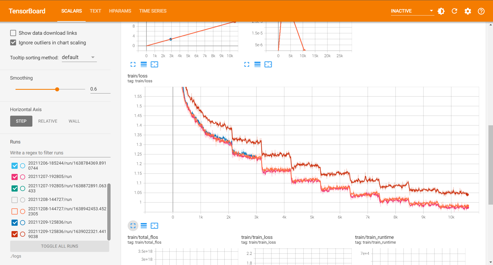

# KoBART Summarization for DACON Competition

본 저장소는 한국가스공사에서 주최 및 주관하고, 데이콘에서 운영하는 [가스・에너지분야 문서요약 모델개발](https://dacon.io/competitions/official/235829/overview/description) 경진대회에 참여한 `이야기연구소 주식회사`팀의 결과 발표 자료입니다. SKT-AI에서 배포한 [KoBART](https://github.com/SKT-AI/KoBART) PLM에 대해, AI Hub에서 제공하는 [문서요약 텍스트](https://aihub.or.kr/aidata/8054)의 신문기사 약 30만건으로 Fine Tuning을 진행하였습니다.

경진대회간 수행 내용을 본 저장소를 통해 공유하는 주요 목적은 다음과 같습니다.

* 경진대회 1차평가 제출
* 대회에서 수행한 실험 과정 및 결과의 신뢰성 함양
* 자료 및 코드의 투명한 공유를 통해 관련 분야에 대한 신진 연구자들의 접근 장벽 완화

경진대회 간 진행했던 세부적인 내용은 [2차 평가 발표자료](./assets/slides.pdf)에서 확인하실 수 있습니다.

## Preliminary

Github 저장소를 내려받아 관련된 코드를 준비합니다.

```bash
$ git clone https://github.com/cawandmilk/gas.git
$ cd gas
```

이후, 파이썬 가상 환경을 만들고, 필요한 라이브러리를 설치합니다.

기본적으로, 사용자는 `Python 3.8` 이상의 버전이 필요합니다.

```bash
$ python -m venv venv
$ source ./venv/bin/activate
$ pip install -r rquirements.txt
```


## Prepare Dataset

본 저장소에서 훈련 및 검증용으로 사용한 데이터세트는 과학기술정보통신부가 주관하고 한국지능정보사회진흥원이 지원하는 `인공지능 학습용 데이터 구축사업`으로 구축된 데이터로, 저작권 및 관련 이용정책에 따라 개인이 임의로 배포할 수 없습니다. 따라서 사용자가 직접 [공식 홈페이지](https://aihub.or.kr/aidata/8054)에서 승인을 받아 파일을 내려받고, 압축을 해제하는 과정이 필요합니다.

평가용 데이터는 [데이콘 경진대회 홈페이지](https://dacon.io/competitions/official/235829/overview/description)에서 받았지만, 대회 규칙상 공식적인 참여자가 아닌 경우 다운로드가 제한될 가능성이 있습니다.

초기 데이터는 아래와 같이 압축 해제되어 있다고 가정합니다.

```bash
$ tree ./data
./data
└── [  52]  raw
    ├── [  94]  Test
    │   ├── [129K]  new_sample_submission.csv
    │   ├── [ 21M]  new_test_.json
    │   ├── [ 34M]  new_test.jsonl
    │   └── [  53]  old
    │       ├── [ 81K]  sample_submission.csv
    │       └── [ 19M]  test.jsonl
    ├── [ 231]  Training
    │   ├── [ 90M]  법률_train_original.json
    │   ├── [346M]  사설잡지_train_original.json
    │   ├── [1.2G]  신문기사_train_original.json
    │   ├── [ 18M]  법률_train_original.zip
    │   ├── [ 83M]  사설잡지_train_original.zip
    │   └── [296M]  신문기사_train_original.zip
    └── [ 231]  Validation
        ├── [8.5M]  법률_valid_original.json
        ├── [ 35M]  사설잡지_valid_original.json
        ├── [140M]  신문기사_valid_original.json
        ├── [1.6M]  법률_valid_original.zip
        ├── [7.9M]  사설잡지_valid_original.zip
        └── [ 34M]  신문기사_valid_original.zip

5 directories, 17 files
```


## Preprocess

모델에 부정적인 영향을 미칠 것으로 예상되는 일부 텍스트에 대한 정제작업을 수행합니다. 이때 `모델에 부정적인 영향을 미칠 것으로 예상`되는 대부분의 데이터들은 어디까지나 개발자의 주관에 의존하므로, 그 범위를 적절히 조정해가며 여러 번 훈련을 진행해야 할 필요성이 있습니다. 가령, 아래와 같은 내용이 있을 수 있습니다.

* 일부 기사에서는, 다음과 같은 광고 문구들이 기사 마지막에 추가되어 있는 경우가 존재합니다. 
  * <"id": "350912775", "media_name": "부산일보">
    * ▶ 네이버에서 부산일보 구독하기 클릭!
    * ▶ 부산일보 구독하고 스타벅스 Get 하자!
  * <"id": "329454903", "media_name": "이데일리">
    * 네이버에서 이데일리 \[구독하기▶\]
    * 빡침해소! 청춘뉘우스~ \[스냅타임▶\]

* 일부 언론사에서는, 다음과 같이 언론사에 종속적인 문구가 반복적으로 등장합니다.
  * <"media_name": "충청일보">
    * 온라인충청일보
  * <"media_name": "중부일보">
    * 연합
  * <"media_name": "전남일보">
    * 뉴시스
    * 편집에디터

* 상당수의 기사에서는, 기자 정보(이름, 이메일주소)를 포함하여 다량의 개인정보가 혼재되어 있습니다.

본 코드에서는, 모든 신문 기사에 적용되는 공통적인 전처리 방법 및 `media_name`에 종속적인 세부 전처리 방법을 구현 및 적용하였으나, 그 성능이 준수하지 않아 최종적으로는 반드시 필요한 전처리만 포함시켰습니다. 결과적으로, 아래 내용이 정규표현식(regular expression)을 이용하여 적용함으로써, 민감정보 이슈가 발생하지 않게 노력하였습니다.

* 기자 이메일을 파싱하여 해당 줄(line)에 포함되어 있는 기자 정보까지 같이 삭제
* 웹 페이지 링크(URL) 제거
* 전화번호 제거 (지역번호, 휴대폰번호 모두 포함)

이후 Dataloader 구성을 위해 훈련, 검증, 평가용 tsv 파일을 생성하며, 특별히 tsv 파일로 만드는 주요 이유는 다음과 같습니다.

* 추후 `pandas.DataFrame`로 tsv 파일을 호출함으로써 입력(text) 및 출력(summary) 쌍이 어긋나지 않음을 보장
* 문서 요약을 위한 [타 저장소](https://github.com/seujung/KoBART-summarization)와의 입력 데이터 호환성 유지

```bash
(venv) $ python preprocess.py \
    --raw_train ./data/raw/Training \
    --raw_valid ./data/raw/Validation \
    --raw_test ./data/raw/Test
```

전처리된 데이터들은 아래 명령어를 통해 확인하실 수 있습니다.

```bash
$ wc -l ./data/*.tsv
     6597 ./data/test.tsv
   271086 ./data/train.tsv
    30123 ./data/valid.tsv
   307806 total
```


## Training

훈련 과정은 `HuggingFace`의 `Seq2SeqTrainingArguments` 및 `Trainer`와 `PyTorch`를 이용하여 구현되었습니다.

아래와 같은 명령어로 훈련을 진행하실 수 있으며, 인자에 대한 구체적인 설명은 [다음](./assets/train_help.txt)을 참고해주세요.

```bash
(venv) $ python finetune_plm_hftrainer.py \
    --train ./data/train.tsv \
    --valid ./data/valid.tsv \
    --pretrained_model_name gogamza/kobart-base-v1 \
    --per_replica_batch_size 16 \
    --lr 5e-5 \
    --weight_decay 1e-2 \
    --gradient_accumulation_steps 8 \
    --n_epochs 10 \
    --model_fpath model
```

사용자는 자신의 컴퓨터 및 GPU 사양에 맞게 `per_replica_batch_size`와 `epoch` 수를 적절하게 조정해주시면 됩니다. `HuggingFace`의 `Trainer`는 현제 시스템에사 사용 가능한 모든 GPU를 끌어다가 사용하기 때문에, GPU가 2개 이상이라면 자동으로 분산(distributed) 학습을 진행합니다. 기본적으로 `Mixed Precision Policy` (=`Automatic Mixed Precision`)가 적용되어 있습니다.

실험 간 발생되는 로그는 기본값으로 `./logs/{CURRENT_DATETIME}`에, 체크포인트는 `./ckpt/{CURRENT_DATETIME}`에 저장되어 있으며, 학습이 종료된 이후 가장 좋았던 latest model을 자동으로 `./ckpt/{CURRENT_DATETIME}/{MODEL_FPATH}.pth`로 저장합니다. 해당 파일에는 모델의 가중치 값(key=`bart`), configuration 파일(key=`config`), 토크나이저(key=`tokenizer`)가 같이 포함되어 있습니다. 하단의 저장 예시를 확인해주세요.

```python
torch.save({
    "bart": trainer.model.state_dict(),
    "config": config,
    "tokenizer": tokenizer,
}, Path(model_dir, ".".join([config.model_fpath, "pth"])))
```

### TensorBoard

실험 진행사항은 아래와 같은 명령어를 사용한 뒤 `{SERVER_IP}:8888`에서 실시간으로 확인이 가능합니다. 만약 로컬에서 확인한다면, `bind_all` 인자를 제거하신 뒤 `localhost:8888`로 접속해주세요.

```bash
(venv) $ tensorboard \
    --logdir ./logs \
    --port 8888 \
    --bind_all
```




## Inference (For DACON Competition Only)

경진대회용 평가 데이터를 이용하여 추론하는 방법의 예시는 아래와 같습니다. 

```bash
(venv) $ python summarize.py \
    --test ./data/test.tsv \
    --model_fpath ./ckpt/{SOME_DATETIME}/model.pth \
    --gpu_id 0 \
    --length_penalty 0.8 \
    --batch_size 64
```

`model_fpath` 인자로는 `*.pth` 파일의 경로를 전달해도 되지만, `HuggingFace`의 `Trainer`로 인해 생성되는 체크포인트 디렉토리를 직접 전달하는 방법 또한 가능합니다.

```bash
(venv) $ python summarize.py \
    --test ./data/test.tsv \
    --model_fpath ./ckpt/{SOME_DATETIME}/checkpoint-{SOME_ITERATIONS} \
    --gpu_id 0 \
    --length_penalty 0.8 \
    --batch_size 64
```

인자에 대한 구체적인 설명은 [다음](./assets/test_help.txt)을 참고해주세요. 


### Generation Sample (for validation dataset)

* id: 472779093

|type|text|
|:-|:-|
|source|성장 속도가 더디고 잔병치레가 많은 아이 등등 부모 눈에는 항상 걱정이 앞선다. 이럴 땐 전문가의 도움을 받아보는 것도 좋다. 다가오는 겨울 방학은 아이의 성장을 체크해 볼 좋은 기회다. 이에 분당 자생한방병원의 김동우 병원장을 만나 '아동 성장'에 대한 궁금증을 풀어보았다. 우선 전신 엑스레이를 찍어 성장판 검사를 하고 척추 측만증과 같이 성장에 방해 될 만한 요인을 찾아보게 됩니다. 성장이 더딘 아이들은 성장판의 뼈 나이가 생리적인 나이보다 높은 경우가 많고 평소 자세가 좋지 않아 성장의 효율성을 떨어뜨리는 경우가 흔합니다. 그 밖에 성장에 영향을 주는 생활 습관도 체크합니다. 언제 성장검사를 해 보는 것이 좋을까요? 요즘 아이들은 성장이 빠르므로 2차 성징이 나타나기 전에 하는 것이 효과적입니다. 일단 성호르몬이 분비되면 성장호르몬 분비가 줄어들므로 특히 여학생의 경우 첫 생리 이전에 받는 것이 중요합니다. 토양이 비옥해야 생장이 좋듯, 아이 몸도 기혈이 충실하면 성장을 잘 하게 됩니다. 때문에 조금이라도 어릴 때 관리를 하면 시간적인 제약도 덜하고 효과도 더 크고 좋게 나타나지요. 만약 성장이 잘 되고 있지 않다는 결과가 나오면 어떻게 해야 할까요? 한방에서는 양생(養生)을 기본으로 합니다. 즉 몸과 마음을 건강하게 하여 질병을 예방하고 생명력을 길러 근본적인 문제를 제거함으로서 성장을 돕는 것인데요. 여기에 개인 개인마다 다르게 적용되는 최적의 치료요법을 동원합니다. 침 치료, 추나요법, 약, 운동 등 여러 박자를 맞추게 되지요. 단순히 양적 성장만을 추구하는 것이 아니라 전반적인 몸의 상태를 좋게 해주는 것이 중요합니다. 또한 잔병치레나 소화불량 등을 회복시켜 평소 성장을 방해하는 요소를 없애줍니다. 그리고 생활 습관도 중요합니다. 집에서 할 수 있는 골격유지운동, 신체의 발란스를 잡아주는 운동, 식습관, 수면, 스트레스 등을 체크하고 보완하여 방향을 잡아줍니다. 겨울 방학에 성장 치료를 받으면 좋은 점이 있나요? 일단 시간적 여유가 있기 때문에 집중적인 치료가 가능합니다. 그리고 계절 중 겨울은 성장이 더딘 계절입니다. 크게 성장하기 위해 저장을 하는 시기입니다. 따라서 이 시기에 치료를 받게 되면 성장에 필요한 요소들을 쌓아두면서 나중에 큰 도움이 될 것입니다. Tip 우리아이 성장 적신호 체크리스트 1. 입이 짧고, 편식을 한다. 2. 고기, 기름진 음식, 찬 음식을 먹으면 소화가 잘 안 된다. 3. 어깨 높이가 다르거나 등이 구부정하는 등 체형이 불균형해 보인다. 4. 수면 습관이 불규칙하고 늦게 잔다. 5. 교우관계나 학교생활에서 스트레스를 많이 받는다. 6. 친구들에 비해 쉽게 지치고, 추위를 많이 탄다. 7. (감기, 체 등)잔병치레가 자주 나고 잘 낫지 않는다.|
|label|분당 자생한방병원에 따르면 다가오는 겨울 방학은 시간적 여유가 있기 때문에 집중적인 치료가 가능해 아이의 성장을 체크해 볼 좋은 기회이며, 한방치료를 하기 전에 전신 엑스레이를 찍어 성장판 검사와 성장방해요인 검사를 하는 등 성장검사를 진행하는 것이 좋다.|
|prediction|성장 속도가 더디고 잔병치레가 많은 아이 등등 부모 눈에는 항상 걱정이 앞선 가운데 분당 자생한방병원의 김동우 병원장을 만나 '아동 성장'에 대한 궁금증을 풀어보았는데, 성장이 더딘 아이들은 성장판의 뼈 나이가 생리적인 나이보다 높은 경우가 많고 평소 자세가 좋지 않아 성장의 효율성을 떨어뜨리는 경우가 흔하다.|

* id: 472779095

|type|text|
|:-|:-|
|source|주요 금융그룹 회장 신년사, 올해 경제상황 심각 인식 … 계열사간 시너지 높이고, 쇄신 요구 금융권은 2일 시무식을 열고 일제히 새해 업무를 시작했다. 주요 금융지주회사 회장들은 올해 신년사를 통해 어느 때보다 험난한 경영환경에 처했음을 강조하면서 내부의 '통합과 혁신'을 강조했다. 다수의 금융권 수장들은 올해 영업환경이 어려울 것임을 예고했다. 윤종규 KB금융지주 회장은 2일 신년사에서 ""올 한해 금융시장은 경쟁이 더욱 심화되고, 위기가 일상화되는 등 지금껏 유례없는 전방위적 압박이 지속 될 것""이라며 ""아마존, 텐센트 등 글로벌 ICT기업이 고객기반과 강력한 플랫폼을 바탕으로 금융업에 진출하고 있어 점점 더 거대한 위협으로 다가오고 있다""고 밝혔다. 김정태 하나금융지주 회장도 1일 발표한 신년사에서 ""2018년부터 세계경제의 경고 신호가 나타나고, 2019년에는 금융시장이 불안해질 것이라고 언급했는 데 현실로 다가오는 듯해 안타깝다""면서 ""작년에 이어 올해도 강력한 DSR 규제여파로 가계대출 증가세는 둔화되고, 중소기업과 자영업자의 휴폐업이 늘어나면서 대손충당금은 더 증가되고, 카드수수료 인하로 수익 축소도 예상된다""고 했다. 금융권 리더들은 이러한 위기적 상황에 대비해 그룹내 통합과 협력을 강조했다. 금융권 1위 자리를 놓고 다투는 KB금융과 신한금융은 동시에 'One KB'와 'One 신한'을 내걸었다. 조용병 신한금융지주 회장은 2일 오전 시무식에서 밝힌 신년사를 통해 ""새해에도 조직과 채널, 인력, 상품·서비스 등 모든 것을 '원 신한'의 관점에서 통합해 그룹 전체가 '하나의 목표'와 '하나의 방향'으로 일관되게 나아가자""면서 ""앞으로도 글로벌부문과 자산관리부문 등 'One 신한' 매트릭스의 성과를 높여 그룹 시너지를 더욱 발휘하고, 인수작업을 진행 중인 오렌지라이프와 아시아신탁 역시 최고의 전문성을 바탕으로 기존 그룹사와 긴밀히 협업을 강화시킬 것""이라고 했다. KB금융 윤 회장도 이날 신년사에서 ""지난 한해 기틀을 다진 'One KB'의 가시적인 성과를 바탕으로 압도적인 리딩금융그룹으로 도약해야 한다""고 했다. 금융권 신년사에서 가장 보편적이고 강력한 주문사항으로 담겨진 내용은 '쇄신'이다. 모든 금융지주 회장들이 신년사에서 스스로 먼저 혁신하지 않으면 살아남기 어렵다는 점을 강조했다. 김광수 농협금융지주 회장은 1일 발표한 신년사에서 ""과거 경영체제에서는 환경변화가 조직·인력의 확충으로 연결돼 이것이 관례화되고 고착화되면서 고정비의 증가로 이어져 지속가능 경영의 걸림돌로 작용했다""면서 ""디지털화에 따라 발생하는 잉여 인력자원은 생산성을 제고하는 방향으로 개선하고, 유사 사업을 하는 계열사간·사업부문간 경합적 요소를 조정하고 비효율을 제거하겠다""고 했다. 올해 초 금융지주사로 전환을 앞둔 손태승 우리은행장도 1일 신년사에서 ""올해 창립 120주년을 기념해 '화폐융통(貨幣融通)은 상무흥왕(商務興旺)의 본(本)'이라는 우리은행의 창립 이념을 되새기고 계승해 경제에 활력을 불어넣고 사회와 은행, 직원 모두가 건강해지는 2019년을 만들어 가겠다""고 밝혔다. 한편 김태영 은행연합회장은 1일 신년사를 통해 '뿌리가 깊으면 가지가 무성하다'는 '근심지무(根深枝茂)'라는 사자성어를 통해 ""올해 우리 금융산업이 글로벌 비즈니스의 질적 성장과 디지털 전환 지속을 통해 내실을 튼튼히 다져 한국 금융이 성장을 지속해 나가는 한 해가 되기를 기대한다""고 밝혔다.|
|label|주요 금융지주회사 회장들은 올해 영업환경이 힘들 것임을 예고하고, 신년사를 통해 험난한 '위기'적 경영환경에서 먼저 혁신하지 않으면 생존할 수 없다며 내부의 '통합과 혁신'을 강조했다.|
|prediction|주요 금융지주회사 회장들은 올해 신년사를 통해 어느 때보다 험난한 경영환경에 처했음을 강조하면서 내부의 '통합과 혁신'을 강조하면서 올해 영업환경이 어려울 것임을 예고했고 금융권 1위 자리를 놓고 다투는 KB금융과 신한금융은 동시에 'One KB'와'One 신한'을 내걸었다.|

* id: 472779096

|type|text|
|:-|:-|
|source|선원들 휴게 및 안전을 위한 공간을 확대한 어선 개발이 완료됐다. 지난해 말 해양수산과학기술진흥원(KIMST, 원장 조승환)이 해양수산부와 함께 개발한 차세대 안전·복지형 어선 표준선형 시제선은 연안복합(9.77톤) 연안통발(9.77톤) 패류형망(4톤) 각 1척씩 3척이다. 이번에 개발한 선박은 해수부가 시범사업을 통해 검증한 새로운 연안어선 길이기준을 적용해 폭과 선체 깊이를 키웠고, 조업안전과 복지 확대를 위한 공간배치 연구 결과를 반영했다. 이에 따라 갑판 아래 있던 선원실을 갑판 위로 배치하고, 화장실 샤워실 주방도 확대했다. 표준선은 공간배치를 달리하면서도 조업 안전성과 복원성, 복지공간 배치가 용이하도록 하는 데 초점을 맞췄다. 어업인 작업상황에 적합하게 편리성을 높이는 데도 집중했다. 그동안 연안어선은 수행하지 않던 복원성 평가도 마쳤다. 선체재질도 기존의 유리섬유 강화 플라스틱(FRP) 재료에서 친환경적인 알루미늄 복합소재로 변경했다. 알루미늄복합소재로 선체 중량을 줄여 유류비도 줄였다. 최재욱 KIMST 수산연구관리실장은 ""차세대 안전·복지형 어선 개발은 노후화된 어선의 구조개선을 위해 필요한 사업""이라며 ""표준선형 3척을 어업인의 실제 조업에 투입해 어업경비 절감 등의 경제성을 평가하고 미흡한 부분이나 개선할 곳이 나타나면 보완해 표준선형에 반영할 예정""이라고 말했다.|
|label|지난해 말 해양수산과학기술진흥원(KIMST)이 해양수산부와 함께 개발한 차세대 안전·복지형 어선 표준선형 시제선 3척에 이어 이번에 개발한 선박은폭과 선체 깊이를 키웠고, 조업안전과 복지 확대를 위한 공간배치 연구 결과를 반영하고, 선체재질도 기존의 유리섬유 강화 플라스틱(FRP) 재료에서 친환경적인 알루미늄 복합소재로 변경했다.|
|prediction|지난해 말 해양수산과학기술진흥원(KIMST, 원장 조승환)이 해양수산부와 함께 개발한 차세대 안전·복지형 어선 표준선형 시제선은 연안복합(9.77톤) 연안통발 패류형망(4톤) 각 1척씩 3척으로 선원들 휴게 및 안전을 위한 공간을 확대한 어선 개발이 완료됐다.|


## Results

[데이콘 경진대회](https://dacon.io/competitions/official/235829/overview/description)에서는 시간 부족으로 실험에 사용되는 인자들을 다음과 같이 고정한 채 추론용 하이퍼 파라미터를 약간씩 조정해가며 성능 변화 추이를 관찰했습니다.

- Default
  - Pretrained language model (PLM): gogamza/kobart-base-v1
  - Pretrained tokenizer: gogamza/kobart-base-v1

- Training
  - Batch size: 256 (=16x2x8)
    - Per replica batch size: 16 (Tesla V100 32GB VRAM)
    - \# GPUs: 2
    - Gradient accumulate steps: 8
  - Learning rate: 5e-5 
  - Warmup rate: 20%
    - Linear warm-up applied (default)
  - Optimizer: AdamW (default optimizer in huggingface)
  - Weight decay: 1e-2
  - Dataloader num workers: 4
  - Mixed Precision Policy: True (fp16 applied)
  - Shuffle
    - On training start: True (sort by length & descending)
    - On epoch end: False (only the once applied)

- Inference
  - Batch size: 64 (only one GPU used)
  - Beam search size: 5
  - Trigram blocking: True (same as the argument "no_repeat_ngram_size=3")


이에 따른 Private Leader Board Score는 다음과 같습니다.

|Name|Clean|Bst./Ep. (\*)|Run T. (H)|Tr-loss|Vl-loss|LP|Min/Max|ROUGE-1|ROUGE-2|ROUGE-N|Note|
|:-:|:-:|:-:|:-:|:-:|:-:|:-:|:-:|:-:|:-:|:-:|:-:|
|20211206<br>-164445|X|7/10 (7)|10.7|1.0466|1.2471|1.2|64/256|0.3671|0.1801|0.2778||
|20211206<br>-164445|X|7/10 (7)|10.7|1.0466|1.2471|1.0|64/256|0.3672|0.1798|0.2785||
|20211206<br>-164445|X|7/10 (7)|10.7|1.0466|1.2471|0.8|64/256|`0.3678`|0.1803|`0.2800`||
|20211206<br>-185244|O|5/10 (5)|10.7|1.1843|1.3380|0.8|64/256|0.3640|`0.1830`|0.2711||
|20211206<br>-164445|X|7/10 (7)|10.7|1.0466|1.2471|0.8|64≥/≤256|0.3575|0.1760|0.2589|variable summary|
|20211207<br>-192805|X|5/10 (5)|7.9|1.1085|`1.2265`|0.8|128/512|0.2846|0.1442|0.2048|variable padding|
|20211207<br>-192805|X|5/10 (5)|7.9|1.1085|`1.2265`|0.8|64/256|0.3662|0.1811|0.2731|variable padding, `final submission`|
|20211207<br>-164445|X|7/10 (10)|10.7|`0.9803`|1.2599|0.8|64/256|0.3446|0.1689|0.2522||
|20211208<br>-144747|X|12/26 (12)|20.6|1.129|1.233|0.8|64/256|0.3613|0.1771|0.2688|Stop at 26/50|
|20211209<br>-125836|△|7/10 (7)|`7.8`|1.0448|1.2311|0.8|64/256|0.3634|0.1781|0.2701||
|20211209<br>-125836|△|7/10 (7)|`7.8`|1.0448|1.2311|0.8|64≥/≤256|0.3617|0.1768|0.2660|variable summary|
|20211206<br>-164445|△|7/10 (7)|10.7|1.0466|1.2471|0.8|64/256|0.3439|0.1660|0.2480|unigram blocking|
|20211206<br>-164445|△|7/10 (7)|10.7|1.0466|1.2471|0.5|64/256|0.3474|0.1721|0.2543||
|20211206<br>-164445|X|7/10 (7)|10.7|1.0466|1.2471|0.6|64/256|0.3469|0.1718|0.2538||

* Clean: 텍스트 클리닝 여부 (X: 전처리 하지 않음, △: 민감정보만 제거, O: 민감정보 및 언론사별 맞춤 정제 추가)
* Bst./Ep. (\*): Validation loss가 가장 좋았던 Epoch / 전체 에폭 (실제 추론에 사용한 에폭)
* LP: Length Penalty
* Min/Max: 요약문의 최소, 최대 길이 (토크나이징 된 요약문의 길이 기준)
* Variable Summary: 입력 데이터의 길이에 따라 요약문의 길이를 가변적으로 결정
* Variable Padding: 입출력 데이터의 패딩을 고정된 값(e.g. 1024, 256 등)이 아닌, 배치 단위에서의 최대 길이로 적용


대회 기간동안 수행된 모든 실험의 로그는 [TensorBoard.dev](https://tensorboard.dev/experiment/q59x1CV9RIydqWWTWWWuXQ/)에 Commit하였으며, Fine-tuning된 모델의 가중치 파일들은 별도로 공유하지 않습니다.

`TensorBoard.dev`에 게시하는 방법은 아래와 같으며, 로컬에서 진행할 경우 높은 확률로 안될 가능성이 있으므로 코랩으로 로그파일을 옮긴 뒤 해당 창에서 아래 명령어를 실행시키시면 됩니다.

```bash
(venv) $ !tensorboard dev upload --logdir ./logs \
    --name "{SOME_NAME_OF_YOUR_LOGS}" \
    --description "{SOME_DESCRIPTION_OF_YOUR_LOGS}" \
    --one_shot
```


세부적인 수행내용이 적힌 2차평가 발표자료는 [다음]()에서 확인하실 수 있습니다.


## Acknowledgement

본 연구는 정보통신산업진흥원에서 진행한 ["2021년 인공지능 고성능 컴퓨팅 자원 지원 사업"](https://www.nipa.kr/main/selectBbsNttView.do?key=122&bbsNo=2&nttNo=1755&bbsTy=biz&searchCtgry=&searchCnd=all&searchKrwd=&pageIndex=1)에 선정되어 지원받은 컴퓨팅 자원을 이용하여 수행되었음을 밝힙니다.


## Reference

`Abstractive Text Summarization` 분야에 관해 좀 더 공부하고자 하시는 분들은, 아래 사이트를 참조하시면 좋을 것 같습니다.

- Documentation
  - [transformers.BartForConditionalGeneration](https://huggingface.co/docs/transformers/model_doc/bart#transformers.BartForConditionalGeneration)
  - [transformers.Trainer](https://huggingface.co/docs/transformers/main_classes/trainer)
  - [uoneway / Text-Summarization-Repo](https://github.com/uoneway/Text-Summarization-Repo)
- Codes
  - [SKT-AI / KoBART](https://github.com/SKT-AI/KoBART)
  - [seujung / KoBART-summarization](https://github.com/SKT-AI/KoBART)
  - [hyunwoongko / kobart-transformers](https://github.com/hyunwoongko/kobart-transformers)
  - [insublee / GAS_summarization](https://github.com/insublee/GAS_summarization)
- Models
  - [HuggingFace Hub](https://huggingface.co/models?search=kobart)
